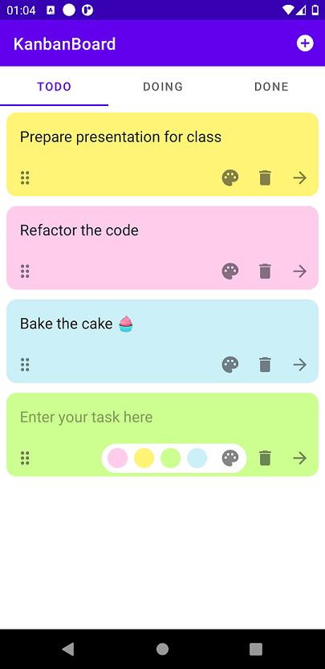

# KanbanBoard
A simple kanban board app natively written in Kotlin. The app consists of three columns where you can add/remove/move tasks and switch their state by moving them between columns.

## App architecture

The app uses a single ViewModel for 3 different fragments (one for each task list) which are hosted in MainActivity. ViewModel contains three lists of Task objects 
(one for each tasklist). TasklistFragments alter data at ViewModel on realtime and changes are saved to local storage when MainActivity's onStop() is called.  
On MainActivity start and stop callbacks, persistent data gets read/written as JSON to the SharedPreferences from the local storage. 
On TasklistFragment creation callback, the fragment populates it's RecyclerView with corresponding Task list from ViewModel. 
